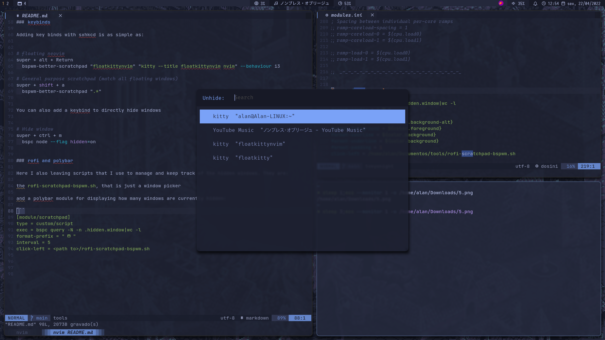
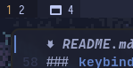

# bspwm-scratchpad

> brings the power of i3 scratchpad to bspwm

this script manages the hidden windows on bspwm based on a search pattern that matches the window's class or title.

## Usage 

```bash
bspwm-scratchpad [pattern] [executable] [--behaviour <i3|swap|nomark>] [--negate]
```

**Example:**

quick access to a neovim instance

```bash
bspwm-scratchpad "floatkitty" "kitty --title floatkittynvim nvim" --behaviour i3

# matches all window with title floatkitty
# launch neovim with title of floatkitty but only when theres no matches
```

## Installation

**Requirements**

- wmctrl
- rg (ripgrep)

download the script. In the code below I'm using git

```bash
git clone 'https://github.com/AlanJs26/bspwm-scratchpad'
cd bspwm-scratchpad
```

give permission for execution and copy to a folder in path (~/local/bin)

```bash
sudo chmod u+x bspwm-scratchpad
sudo mv bspwm-scratchpad ~/.local/bin
```

## Tips

### bspc rules

I recommend the addition of bspc rules to automatically set windows floating state.

using the example of the kitty window:

```bash
# transform all windows with title "floatkitty" into floating windows 
bspc rule -a "*:*:floatkitty" state=floating center=on
```

### keybinds

Adding key binds with sxhkcd is as simple as:

```bash
# floating neovim
super + alt + Return
	bspwm-better-scratchpad "floatkittynvim" "kitty --title floatkittynvim nvim" --behaviour i3

# General purpose scratchpad (match all floating windows)
super + shift + a
	bspwm-better-scratchpad ".*"
```

You can also add a keybind to directly hide windows

```bash
# Hide window
super + ctrl + m
	bspc node --flag hidden=on
```

### rofi and polybar

Here I also leaving scripts that I use to manage and keep track of hidden windows. They are:

the `rofi-scratchpad-bspwm.sh`, that is just a window picker using rofi



and a polybar module for displaying how many windows are currently hidden:

```ini
[module/scratchpad]
type = custom/script
exec = bspc query -N -n .hidden.window|wc -l
format-prefix = "  "
interval = 5
click-left = <path to>/rofi-scratchpad-bspwm.sh 
```


